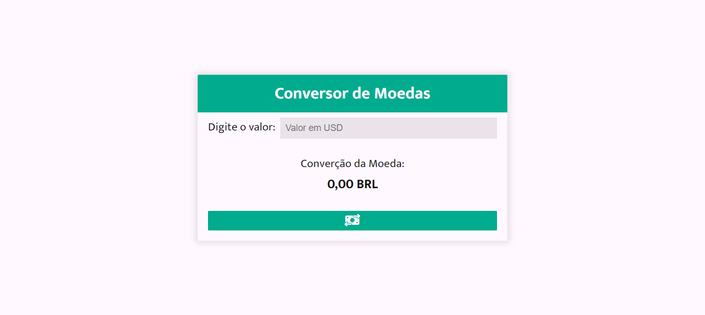

<h1 align="center">
  Conversor de Moedas
</h1>

  

## Projeto - Conversor de Moedas

Este projeto foi criado para oferecer uma ferramenta de conversão de moeda usando a API da ExchangeRate-API.
Ele permite que os usuários convertam de USD para BRL com facilidade, inserindo o valor e clicando em um botão.
O projeto é bem estruturado, possui um estilo simples e segue os padrões de código limpo.

Tecnologias Utilizadas:
* [HTML (Linguagem de marcação):](https://www.w3schools.com/html/html_intro.asp) Utilizado para estruturar e definir o conteúdo da página, incluindo cabeçalhos, parágrafos, listas e imagens.
* [CSS (Folha de estilos em cascata):](https://www.w3schools.com/css/css_intro.asp) Utilizado para estilizar os elementos da página, definindo cores, tamanhos, fontes e layout, proporcionando uma aparência visualmente atraente.
* [JavaScript:](https://developer.mozilla.org/pt-BR/docs/Web/JavaScript) Utilizado para adicionar interatividade à página, permitindo que o usuário selecione personagens e exiba informações dinamicamente.
* [Font Awesome:](https://fontawesome.com/search?o=r&m=free&f=classic) O Font Awesome é uma biblioteca de ícones e símbolos prontos para serem incorporados em sites e aplicativos, com o objetivo de aprimorar sua estética e usabilidade. Esses ícones podem ser personalizados e escalados com facilidade.
* [Google Fonts:](https://fonts.google.com/specimen/Mukta?query=Mukta) Utilizado para acessar e aplicar fontes personalizadas aos textos da página, melhorando a estilização e a legibilidade.
* [ExchangeRate-API](https://www.exchangerate-api.com/) Oferece uma API gratuita e fácil de usar para obter taxas de câmbio em tempo real e histórico.

Implantação do Projeto no Netlify: [Explore o projeto clicando aqui.](https://conversor-moedas-v1.netlify.app/)

Créditos:
* Criado por minha autoria | [José Carlos • jcddsj01](https://github.com/jcddsj01)

---

## Project - Currency converter

This project was created to offer a currency conversion tool using the ExchangeRate-API.
It allows users to convert from USD to BRL easily by entering the amount and clicking a button.
The project is well structured, has a simple style and follows clean code standards.

Technologies used:
* [HTML (HyperText Markup Language):](https://www.w3schools.com/html/html_intro.asp) Used to structure and define page content, including headings, paragraphs, lists and images.
* [CSS (Cascading Style Sheets):](https://www.w3schools.com/css/css_intro.asp) Used to style the elements of the page, defining colors, sizes, fonts and layout, providing a visually appealing appearance.
* [JavaScript:](https://developer.mozilla.org/pt-BR/docs/Web/JavaScript) Used to add interactivity to the page, allowing the user to select characters and display information dynamically.
* [Font Awesome:](https://fontawesome.com/search?o=r&m=free&f=classic) Font Awesome is a library of icons and symbols ready to be incorporated into websites and applications to improve their aesthetics and usability. These icons can be customized and scaled with ease.
* [Google Fonts:](https://fonts.google.com/specimen/Mukta?query=Mukta) Used to access and apply custom fonts to page texts, improving stylization and readability.
* [ExchangeRate-API](https://www.exchangerate-api.com/) It offers a free and easy-to-use API to obtain real-time and historical exchange rates.

Credits:
* Created by me | [José Carlos • jcddsj01](https://github.com/jcddsj01)

Project deployment on Netlify: [Explore the project by clicking here.](https://conversor-moedas-v1.netlify.app/)
